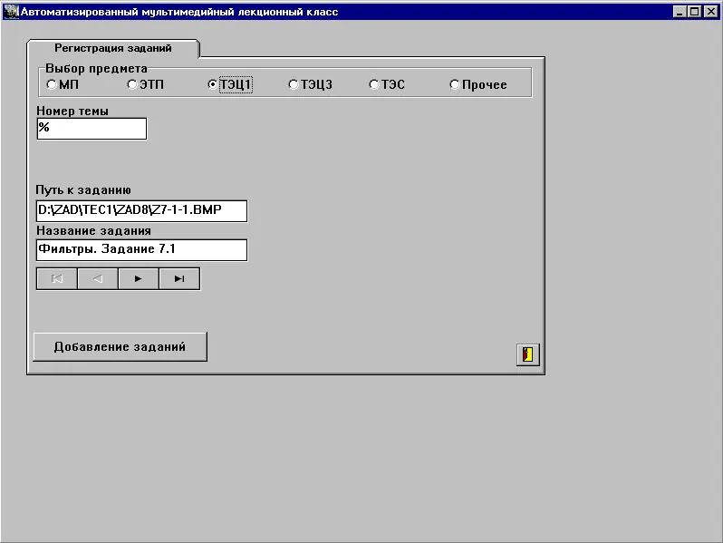
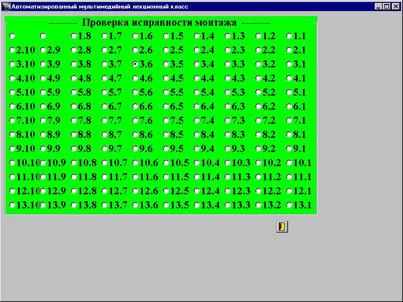
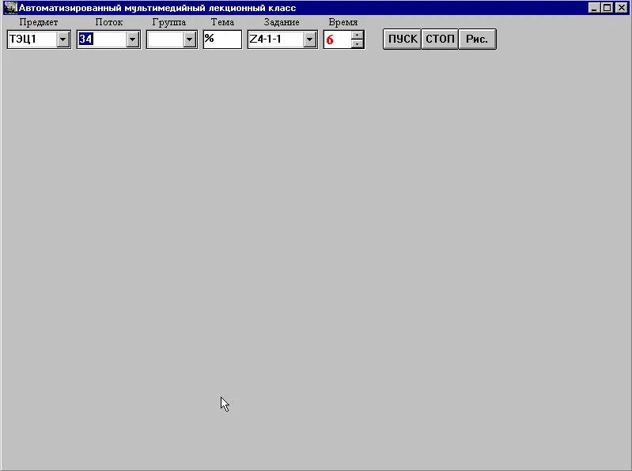
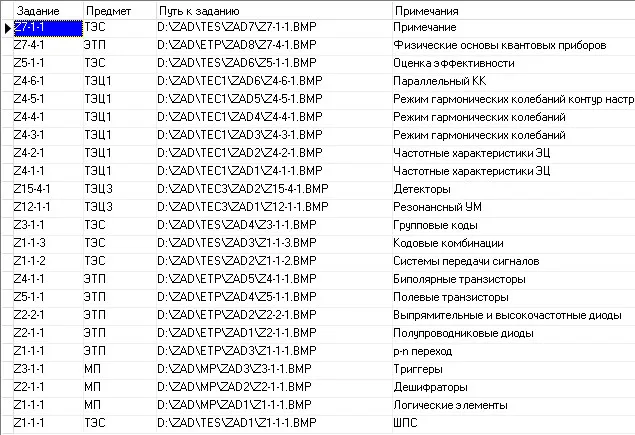
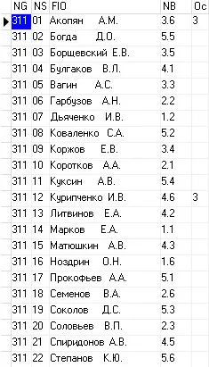
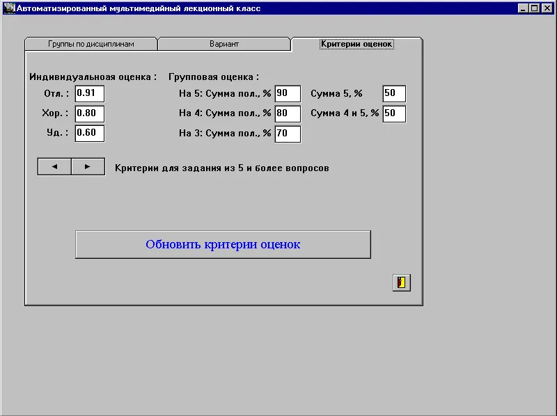
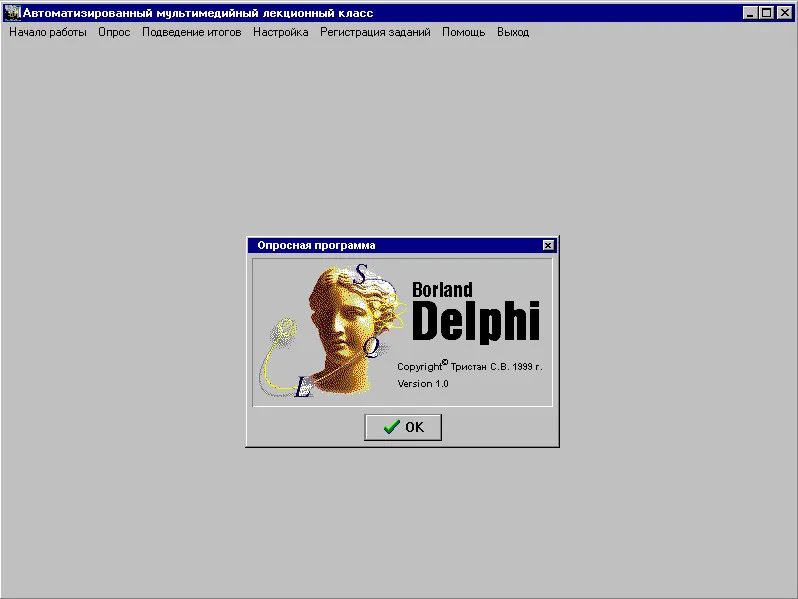

# Automated-Multimedia-Lecture-Hall
Автоматизированный мультимедийный лекционный класс

## Описание

**Автоматизированный мультимедийный лекционный класс (АМЛК)** — это система автоматизированного опроса учащихся, разработанная для упрощения и оптимизации процесса проведения лекционных занятий. Система позволяет преподавателям эффективно фиксировать присутствие студентов и собирать данные о их ответах на вопросы в реальном времени, обеспечивая интерактивный образовательный процесс и способствуя активному участию учащихся.

## Функции

1. **Учет присутствия**:
   - Программа фиксирует отсутствие или присутствие учащихся на занятии, используя аппаратные кнопки, расположенные на каждом месте в аудитории. Каждая кнопка подключена к специальному аппаратному обработчику, который регистрирует нажатия и передает данные в программу.

2. **Подготовка вопросов**:
   - Преподаватели могут заранее загружать изображения с вопросами и соответствующими вариантами ответов в базу данных системы. Каждый вопрос может иметь несколько вариантов ответа, что позволяет проводить разнообразные опросы.

3. **Проверка соединения**:
   - Система проводит проверку исправности соединения с каждой кнопкой (местом учащегося) перед началом занятия, чтобы гарантировать корректную работу во время опроса.

4. **Проведение опроса**:
   - Во время занятия преподаватель выводит изображения и варианты ответов на проектор. Учащиеся должны нажать соответствующую кнопку, чтобы зарегистрировать свой ответ.

	

5. **Анализ данных**:
   - Программа собирает данные о нажатиях (ответах) учащихся и анализирует их на основе заранее определенных критериев. Результаты хранятся в базе данных и могут быть проанализированы различными способами, предоставляя ценную информацию о успеваемости учащихся.

## Архитектура системы

Система АМЛК состоит из двух основных компонентов: программного обеспечения и аппаратного обеспечения, которые должны работать в согласованной архитектуре для обеспечения корректной работы.

### 1. Программное обеспечение

**Язык разработки**: Delphi 1.0.

Система включает следующие основные модули:

- **Модуль управления пользователями**: отвечает за регистрацию и учет присутствия учащихся. Он управляет состоянием каждой кнопки и фиксирует нажатия, записывая их в базу данных.

- **Модуль загрузки вопросов**: позволяет преподавателю загружать изображения и соответствующие варианты ответов, храня их в базе данных.

- **Модуль опроса**: управляет отображением вопросов на проекторе и считывает нажатия кнопок от учащихся. Он также производит анализ ответов и выставляет оценки на основе заданных критериев.

- **Модуль отчетности**: предоставляет интерфейс для анализа собранных данных, позволяя преподавателям формировать отчеты о успеваемости.

- **Ассемблерные вставки**: Код включает вставки на ассемблере, обеспечивающие низкоуровневое взаимодействие с драйвером аппаратного обработчика. Это позволяет напрямую управлять состоянием кнопок и оптимизировать обработку событий, что улучшает общую производительность системы.

### 2. Аппаратное обеспечение

#### Аппаратный обработчик нажатий кнопок

Аппаратный обработчик представляет собой специализированное устройство, подключенное к компьютеру через интерфейс VESA. Он состоит из следующих компонентов:

- **Кнопки**: На каждой парте установлена кнопка, соединенная с обработчиком, что позволяет учащимся регистрировать свои ответы на опросы. Каждая кнопка имеет уникальный идентификатор, соответствующий месту учащегося.

- **Обработчик нажатий**: Это устройство принимает сигналы от кнопок и преобразует их в цифровую информацию, передавая данные в память компьютера. При этом изменения состояния нажатий кнопок отображаются в области памяти размером 16 x 8 байт, где каждый бит соответствует состоянию отдельного учащегося.

#### Взаимодействие программного и аппаратного обеспечения

Для обеспечения взаимодействия между программным и аппаратным компонентами системы необходимо использование драйвера, который обеспечивает корректное считывание и интерпретацию сигналов от аппаратного обработчика. Драйвер выполняет следующие функции:

- **Обработка событий**: Драйвер слушает входные сигналы от аппаратного обработчика и передает информацию о нажатиях в программное обеспечение АМЛК.

- **Управление состоянием кнопок**: Драйвер контролирует состояние каждой кнопки (нажата/не нажата), что позволяет программному обеспечению точно фиксировать присутствие студентов.

- **Мониторинг связи**: Драйвер также осуществляет контроль исправности соединений, выявляя возможные проблемы и сообщая о них программе.

### 3. База данных

Система использует реляционную базу данных для хранения информации о присутствии учащихся, их ответах на опросы и полученных оценках. База данных включает следующие таблицы:

- **Groupred**: содержит информацию о студентах, их идентификаторы и привязанные места.
- **Zadanie**: хранит загруженные изображения вопросов и варианты ответов.

- **Ocenka**: хранит оценки полученные учащимся.

- **Kriterii**: хранит критерии для оценки ответов учащихся.

## Установка

1. Убедитесь, что у вас установлено необходимое оборудование, включая аппаратный обработчик и кнопки.
2. Скопируйте проект на локальный компьютер.
3. Установите драйвер для аппаратного обработчика, чтобы обеспечить корректное взаимодействие с программным обеспечением.
4. Соберите проект в среде Delphi 1.0.
5. Запустите программу и следуйте инструкциям на экране.

## Использование

1. Запустите программу и загрузите предварительно подготовленные изображения с вопросами.
2. Начните занятие, активировав учет присутствия.
3. Проведите опрос, выводя вопросы на проектор.
4. Анализируйте полученные данные в базе данных после завершения занятия, используя модуль отчетности.

## Руководство пользователя

Система АМЛК сопровождается детальным руководством пользователя, которое предоставляет пошаговые инструкции по настройке, использованию и администрированию системы. Руководство охватывает все аспекты работы с программой, включая подготовку и загрузку вопросов, проведение опросов и анализ собранных данных. Оно предназначено для того, чтобы помочь преподавателям и техническим специалистам эффективно использовать систему и избежать распространенных ошибок.

